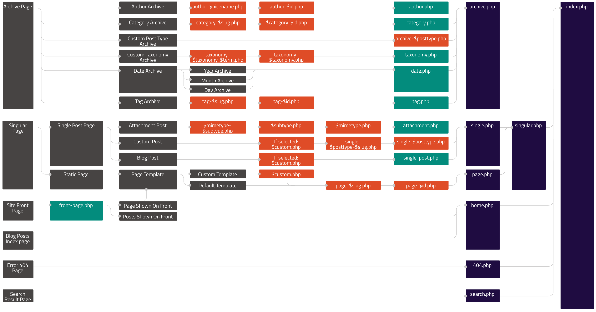

theme: Plain Jane, 2
slidecount: true
slidenumbers: true
build-lists: true
autoscale: true


## Udržitelnost WordPress webu

### Petr Hlavička
#### [hlavicka.cz](https://www.hlavicka.cz/)

[.slidecount: false]
[.slidenumbers: false]

---
[.footer: Petr Hlavička: Udržitelnost WordPress webu]
[.build-lists: false]

# Obsah

-   Prémiové šablony a pluginy
-   Struktura
-   Nástroje
-   Verzování
-   Deployment
-   Testování
-   Dokumentace

---
[.slidecount: false]
[.slidenumbers: false]


---
[.footer: Petr Hlavička: Udržitelnost WordPress webu - Úvod]

# Co pro mě znamená, že je projekt udržitelný?

---
[.footer: Petr Hlavička: Udržitelnost WordPress webu - Úvod]

# Cíl přednášky.

---
[.footer: Petr Hlavička: Udržitelnost WordPress webu - Úvod]

# Proč je dobré tu udržitelnost řešit?

---
[.footer: Petr Hlavička: Udržitelnost WordPress webu - Úvod]

> Myslet dopředu.

---
[.footer: Petr Hlavička: Udržitelnost WordPress webu - Prémiové šablony a pluginy]

# Jaké problémy vidím s premiovými šablonami?

-   aktualizace
-   co maj "pod kapotou"?
-   uzamčení obsahu (*theme/plugin lock-in*)

---
[.footer: Petr Hlavička: Udržitelnost WordPress webu - Prémiové šablony a pluginy]

# Nad čím se zamyslet při výběru pluginu?

-   Opravdu je potřeba?
-   Jak kritický bude pro web?
-   Jaká je podpora? Vývoj?
-   Je bezpečný? ([WPScan Vulnerability Database](https://wpvulndb.com))

---
[.footer: Petr Hlavička: Udržitelnost WordPress webu - Prémiové šablony a pluginy]

## Shrnutí

-   Nemáte kontrolu nad vývojem šablony / pluginu.
-   :arrow_heading_down: závislostí :arrow_heading_up: kontrola :arrow_right: **udržitelnější**.
-   :arrow_heading_down: závislostí :arrow_heading_up: čas :arrow_right: **dražší**.

---
[.footer: Petr Hlavička: Udržitelnost WordPress webu - Webové frameworky]

# Webové frameworky


-   Struktura
-   Nástroje
-   Verzování
-   Deployment (CI/CD)
-   Testování
-   Dokumentace

---
[.footer: Petr Hlavička: Udržitelnost WordPress webu - Struktura]

# Struktura WordPressu

```
site/
├── index.php
├── license.txt
├── readme.html
├── wp-activate.php
├── wp-admin/
├── wp-blog-header.php
├── wp-comments-post.php
├── wp-config.php
├── wp-config-sample.php
├── wp-content/
│   ├── themes/
│   ├── languages/
│   └── plugins/
├── wp-cron.php
├── wp-includes/
├── wp-links-opml.php
├── wp-load.php
├── wp-login.php
├── wp-mail.php
├── wp-settings.php
├── wp-signup.php
├── wp-trackback.php
└── xmlrpc.php
```

---
[.footer: Petr Hlavička: Udržitelnost WordPress webu - Struktura]

# Struktura WordPressu

```[.highlight: 9, 11, 12, 14]
site/
├── index.php
├── license.txt
├── readme.html
├── wp-activate.php
├── wp-admin/
├── wp-blog-header.php
├── wp-comments-post.php
├── wp-config.php
├── wp-config-sample.php
├── wp-content/
│   ├── themes/
│   ├── languages/
│   └── plugins/
├── wp-cron.php
├── wp-includes/
├── wp-links-opml.php
├── wp-load.php
├── wp-login.php
├── wp-mail.php
├── wp-settings.php
├── wp-signup.php
├── wp-trackback.php
└── xmlrpc.php
```

---
[.footer: Petr Hlavička: Udržitelnost WordPress webu - Struktura]

## Struktura WordPress šablony



---
[.footer: Petr Hlavička: Udržitelnost WordPress webu - Struktura]

## Struktura WordPress šablony
# Proč to řešit?

-   Povinné soubory šablony:
    -   `index.php`
    -   `style.css`

---
[.footer: Petr Hlavička: Udržitelnost WordPress webu - Struktura]

## Struktura WordPress šablony
# Jaké máme možnosti?

-   Oficiální (doporučená)[^1]
-   Použití WordPress frameworku
-   Vlastní

[^1]: [Organizing Theme Files | WordPress Developer Resources](https://developer.wordpress.org/themes/basics/organizing-theme-files/)

---
[.footer: Petr Hlavička: Udržitelnost WordPress webu - Struktura]

# Oficiální (doporučená)

```
theme/
├── 404.php
├── archive.php
├── assets/
├── comments.php
├── footer.php
├── front-page.php
├── functions.php
├── header.php
├── inc/
├── index.php
├── page.php
├── README.txt
├── rtl.css
├── screenshot.png
├── search.php
├── searchform.php
├── sidebar.php
├── single.php
├── style.css
└── template-parts/
```

---
[.footer: Petr Hlavička: Udržitelnost WordPress webu - Struktura]

# Oficiální (doporučená)

```[.highlight: 4, 8, 10, 21]
theme/
├── 404.php
├── archive.php
├── assets/
├── comments.php
├── footer.php
├── front-page.php
├── functions.php
├── header.php
├── inc/
├── index.php
├── page.php
├── README.txt
├── rtl.css
├── screenshot.png
├── search.php
├── searchform.php
├── sidebar.php
├── single.php
├── style.css
└── template-parts/
```

---
[.footer: Petr Hlavička: Udržitelnost WordPress webu - Struktura]

# Použití WordPress frameworku

-   Usnadnění vývoje.
-   Možný odklon od standardního vývoje šablon.
-   Další závislost v projektu.
-   Hotová dokumentace.

---
[.footer: Petr Hlavička: Udržitelnost WordPress webu - Struktura]

# Ukázka struktury Assely

```
theme/
├── app
├── bootstrap
├── composer.json
├── composer.lock
├── config
├── functions.php
├── gulpfile.js
├── index.php
├── package.json
├── public
├── README.md
├── resources
├── screenshot.png
├── storage
├── style.css
└── vendor
```

---
[.footer: Petr Hlavička: Udržitelnost WordPress webu - Struktura]

# Ukázka struktury Assely

```[.highlight: 7, 9, 14, 16]
theme/
├── app
├── bootstrap
├── composer.json
├── composer.lock
├── config
├── functions.php
├── gulpfile.js
├── index.php
├── package.json
├── public
├── README.md
├── resources
├── screenshot.png
├── storage
├── style.css
└── vendor
```

---
[.footer: Petr Hlavička: Udržitelnost WordPress webu - Struktura]

## Použití WordPress frameworku
# Doporučení

-   Druh implementace.
-   Zvážit omezení, které mají.
-   Vývoj a podpora frameworku.
-   Vyzkoušet!

---

# Nelíbí se ani jedna z variant?


---
[.footer: Petr Hlavička: Udržitelnost WordPress webu - Struktura]

# Vlastní struktura
# Doporučení

-   Samostatný git repozitář.
-   S dokumentací.
-   Nechte se inspirovat.
-   Myslet dopředu.

---
[.footer: Petr Hlavička: Udržitelnost WordPress webu - Struktura]

# Struktura WordPress pluginu

-   Princip stejný jako u šablon.
-   Kde se inspirovat:
    -   [WordPress Plugin Boilerplate](https://github.com/DevinVinson/WordPress-Plugin-Boilerplate) a s tím spojený [Plugin Directory Boilerplate](https://github.com/DevinVinson/Plugin-Directory-Boilerplate).
    -   Frameworky: [WordPress Plugin Framework](https://wordpress.org/plugins/wordpress-plugin-framework/), [Herbert](https://github.com/getherbert/herbert), [WordPress Plugin Template](https://github.com/hlashbrooke/WordPress-Plugin-Template/).

---
[.footer: Petr Hlavička: Udržitelnost WordPress webu - Struktura]

# Struktura souborů je pouze základ

-   Standardizovat si kód
    -   Vlastní standardy
    -   Cizí standardy např. [WordPress Coding Standards](https://make.wordpress.org/core/handbook/best-practices/coding-standards/) + kontrola ([WordPress Coding Standards for PHP_CodeSniffer](https://github.com/WordPress-Coding-Standards/WordPress-Coding-Standards))
-   Standardizovat si nastavení editoru
    -   Soubor `.editorconfig` ([editorconfig.org](http://editorconfig.org))

---
[.footer: Petr Hlavička: Udržitelnost WordPress webu - Struktura]

# Je vhodné předem informovat klienta o nestandardních komponentách projektu.


---
[.footer: Petr Hlavička: Udržitelnost WordPress webu - Nástroje]

# Nástroje

-   [WP-CLI](https://make.wordpress.org/cli/)
-   [GenerateWP](https://generatewp.com/generator/)
-   Plugin [Developer](https://wordpress.org/plugins/developer/) + jim doporučené pluginy
-   Případné nástroje frameworků.

---
[.footer: Petr Hlavička: Udržitelnost WordPress webu - Nástroje]

# Lokální vývojové prostředí

-   přímo
-   hotové řešení
    -   [WPLib Box](http://wplib.github.io/wplib-box/), [Local](https://local.getflywheel.com) (bývalý Pressmatic) či [Trellis](https://roots.io/trellis/) pro Bedrock.
-   [Vagrant](https://www.vagrantup.com)
    -   [VCCW](http://vccw.cc)
-   [Docker](https://www.docker.com)
    -   [Local WordPress Development with Docker: 3 Easy Steps](https://medium.com/@tatemz/local-wordpress-development-with-docker-3-easy-steps-a7c375366b9) & [Using wp-cli with Docker](https://medium.com/@tatemz/using-wp-cli-with-docker-21b0ab9fab79)

---
[.footer: Petr Hlavička: Udržitelnost WordPress webu - Nástroje]
[.build-lists: false]

# Offline dokumentace

-   [Dash](https://kapeli.com/dash) - macOS, iOS
-   [Zeal](https://zealdocs.org) - Windows, Linux
-   [Velocity](http://velocity.silverlakesoftware.com) - Windows

---
[.footer: Petr Hlavička: Udržitelnost WordPress webu - Verzování]

# Verzování


-   Nic 2x
-   Jen svoji práci
-   Vše kritické

---
[.footer: Petr Hlavička: Udržitelnost WordPress webu - Verzování]

# Jaké jsou možnosti?

-   Git submoduly
-   Composer
-   VersionPress

---
[.footer: Petr Hlavička: Udržitelnost WordPress webu - Verzování]

# Git submoduly

-   Propojování git repositářů.
-   [WordPress](https://github.com/WordPress/WordPress) na GitHub
-   [WP Plugins](https://github.com/wp-plugins) na GitHub

---
[.footer: Petr Hlavička: Udržitelnost WordPress webu - Verzování]

## Git submoduly
# Ukázka struktury

```
site/
├── index.php
├── wp-config.php
├── wp-content/
│   ├── plugins/
│   │   └── wordpress-seo/  # Plugin jako submodul
│   └── themes/
│       └── theme/          # Vlastní šablona
├── wp-cli.yml              # Info pro WP-CLI, kde je WP
└── wp/                     # WordPress jako submodul
```

---
[.footer: Petr Hlavička: Udržitelnost WordPress webu - Verzování]

## Git submoduly
# Co se výsledně verzuje

```[.highlight: 2, 3, 8, 9]
site/
├── index.php
├── wp-config.php
├── wp-content/
│   ├── plugins/
│   │   └── wordpress-seo/  # Plugin jako submodul
│   └── themes/
│       └── theme/          # Vlastní šablona
├── wp-cli.yml              # Info pro WP-CLI, kde je WP
└── wp/                     # WordPress jako submodul
```

---
[.footer: Petr Hlavička: Udržitelnost WordPress webu - Verzování]

## Git submoduly
# Výhody

-   Jen důležité.
-   Verze WP a pluginů.
-   Žádný další nástroj.
-   Jednoduchý deployment pomocí [Git-ftp](https://github.com/git-ftp/git-ftp).

---
[.footer: Petr Hlavička: Udržitelnost WordPress webu - Verzování]

## Git submoduly
# Nevýhody

-   Náročnější správa verzí WP a pluginů.
-   Nelze aktualizovat pluginy a ani WP z admina či WP-CLI.
-   Klade vyšší nároky na znalost gitu.

---
[.footer: Petr Hlavička: Udržitelnost WordPress webu - Verzování]

# Composer

-   Balíčkovací systém pro PHP.
-   Možné díky [WordPress Packagist](https://wpackagist.org) - WordPress sám o sobě nepodporuje Composer[^2].
-   Využívá např. [Bedrock](https://roots.io/bedrock/), [WP Starter](https://wecodemore.github.io/wpstarter/) a další.

[^2]: [#23912 (Add Composer package description) – WordPress Trac](https://core.trac.wordpress.org/ticket/23912)

---
[.footer: Petr Hlavička: Udržitelnost WordPress webu - Verzování]

## Composer
# Ukázka: instalace Bedrocku

1.  `composer create-project roots/bedrock`
2.  Nastavení DB, WP Salt a další v souboru `.env`.
3.  Hotovo.

---
[.footer: Petr Hlavička: Udržitelnost WordPress webu - Verzování]

## Composer
# Práce s Composerem

-   Instalace pluginu: `composer require wpackagist-plugin/wordpress-seo`
-   Aktualizace WP a pluginů: `composer update`

---
[.footer: Petr Hlavička: Udržitelnost WordPress webu - Verzování]

# Ukázka struktury Bedrocku

```
site/
├── config/
│   ├── environments/
│   │   ├── development.php
│   │   ├── staging.php
│   │   └── production.php
│   └── application.php   # Primary wp-config.php
├── vendor/               # Composer dependencies
└── web/                  # Virtual host document root
    ├── app/              # WordPress content directory
    │   ├── mu-plugins/
    │   ├── plugins/
    │   ├── themes/
    │   └── uploads/
    └── wp/               # WordPress core
```

---
[.footer: Petr Hlavička: Udržitelnost WordPress webu - Verzování]

## Composer
# Výhody

-   `composer.json`

---
[.footer: Petr Hlavička: Udržitelnost WordPress webu - Verzování]

## Composer
# Nevýhody

-   Nutný deployment.
-   Vyšší požadavky na hosting.
-   Nelze aktualizovat pluginy a ani WP z admina či WP-CLI.

---
[.footer: Petr Hlavička: Udržitelnost WordPress webu - Verzování]

# VersionPress

-   Trochu jiné verzování, než předchozí varianty.
-   Stále ve vývoji.

---
[.footer: Petr Hlavička: Udržitelnost WordPress webu - Verzování]

# Další možnost
## `.gitignore`[^3]

-   Zakázání verzování všeho kromě vlastní šablony a podpůrných souborů.
-   Neverzuje se verze WP a pluginů.
-   WP-CLI, aktualizace přímo, jednoduchý deployment.

[^3]: [WordPress .gitignore](https://salferrarello.com/wordpress-gitignore/)

---
[.footer: Petr Hlavička: Udržitelnost WordPress webu - Verzování]

# Zamyšlení: WP-CLI pro správu verzí WP a pluginů?

-   `wp-cli.json`
-   `wp plugin install wordpress-seo`, `wp plugin update --all`, `wp core update`, ...
-   nové příkazy `wp install`, `wp update`
-   tak kdyby se někdo nudil... :thumbsup:

---
[.footer: Petr Hlavička: Udržitelnost WordPress webu - Verzování]

# Možnosti verzování databáze

-   [DBV](https://dbv.vizuina.com) - webové rozhraní, umí vytvářet migrace
-   [MMP](https://github.com/idler/MMP) - CLI, umí vytvářet migrace
-   [DBVC](https://github.com/jasny/dbvc) - CLI, neumí vytvářet migrace
-   [VersionPress](https://versionpress.net) - pro podporované pluginy

---
[.footer: Petr Hlavička: Udržitelnost WordPress webu - Deployment]

# Deployment

-   Development -> Staging -> Production.
-   Součást CI[^4]/CD[^5].
-   Automaticky.

[^4]: [Continuous integration](https://en.wikipedia.org/wiki/Continuous_integration)

[^5]: [Continuous delivery](https://en.wikipedia.org/wiki/Continuous_delivery)

---
[.footer: Petr Hlavička: Udržitelnost WordPress webu - Deployment]

## Deployment
# Jak si vybrat?

-   Dle požadavků
-   Dle rozpočtu
-   Dle preferencí

---
[.footer: Petr Hlavička: Udržitelnost WordPress webu - Deployment]

## Deployment
# Obecné požadavky

-   Specifickou strukturu (pro služby nebo nástroje pro WP)
-   Repositáře na GitLab/GitHub (pro automatický deploy)
-   FTP nebo nejlépe VPS

---
[.footer: Petr Hlavička: Udržitelnost WordPress webu - Deployment]

## Deployment: Nástroje

-   Jednoduché (nízkonákladové):
    -   [Git-ftp](https://github.com/git-ftp/git-ftp) - development -> production
    -   Git na hostingu (některé sdílené mají podporu gitu) - vlastní řešení (`git pull`) nebo [VersionPress](http://versionpress.net/) plugin
-   Nástroje pro WP (nutný SSH přístup a další utility na straně serveru):
    -   [wp-deploy](https://github.com/Mixd/wp-deploy) - Capistrano
    -   [Evolution WordPress](https://github.com/evolution/wordpress) - Vagrant, Ansible, Capistrano
    -   [WP Stack](https://github.com/markjaquith/WP-Stack) - Capistrano
    -   [Wordmove](https://github.com/welaika/wordmove) - Ruby Gem pro development <=> production
    -   [DebOps for WordPress](https://github.com/carlalexander/debops-wordpress) - Python, Ansible, DebOps
    -   [bedrock-capistrano](https://github.com/roots/bedrock-capistrano) - Capistrano pro Bedrock
    -   [Trellis](https://roots.io/trellis/) - Vagrant, Ansible pro Bedrock

---
[.footer: Petr Hlavička: Udržitelnost WordPress webu - Deployment]

## Deployment: Služby

-   Univerzální služby:
    -   [DeployBot](https://deploybot.com)
    -   [DeployHQ](https://www.deployhq.com)
-   WP služby:
    -   [Pantheon](https://pantheon.io)
    -   [WP Engine](https://wpengine.com)
    -   [VersionPress.com](http://versionpress.com)
    -   [Presslabs](https://www.presslabs.com), [Gitium](https://wordpress.org/plugins/gitium/)
    -   [Flywheel](https://getflywheel.com)

---
[.footer: Petr Hlavička: Udržitelnost WordPress webu - Deployment]

## Deployment: Zajímavé

-   Deploy pouze šablony či pluginu
    -   [WP Pusher](https://wppusher.com)
    -   [GitHub Updater](https://github.com/afragen/github-updater)

---
[.footer: Petr Hlavička: Udržitelnost WordPress webu - Testování]

# Testování

-   [Plugin Unit Tests](https://make.wordpress.org/cli/handbook/plugin-unit-tests/) - PHPUnit, WP-CLI
-   [Codeception pro WP](https://codeception.com/for/wordpress) - přes Composer, Integration Tests, WordPress Functional Tests, Acceptance Tests, BDD
-   Zajímavé odkazy:
    -   [WP Test](http://wptest.io) - kolekce dat pro testování WP
    -   [Unit Testing WordPress Plugins with PHPUnit](https://premium.wpmudev.org/blog/unit-testing-wordpress-plugins-phpunit/)
    -   [Introduction to WordPress Unit Testing](https://carlalexander.ca/introduction-wordpress-unit-testing/)

---
[.footer: Petr Hlavička: Udržitelnost WordPress webu - Dokumentace]

# Dokumentace

-   Rychlejší orientace v projektu.
-   Stručně. Jasně.
-   Wiki u GitLab/GitHub.
-   Dokumentovat i kód ([PHP Documentation Standards](https://make.wordpress.org/core/handbook/best-practices/inline-documentation-standards/php/)).

---
[.footer: Petr Hlavička: Udržitelnost WordPress webu]

# Shrnutí

---
[.footer: Petr Hlavička: Udržitelnost WordPress webu]

# Dotazy?


---
[.footer: Petr Hlavička: Udržitelnost WordPress webu]

#### Prezentace bude dostupná na GitHubu. Sledujte [@WordCampPraha](https://twitter.com/WordCampPraha) na Twitteru.

## Děkuji za pozornost.


### Petr Hlavička
#### [hlavicka.cz](https://www.hlavicka.cz/)
